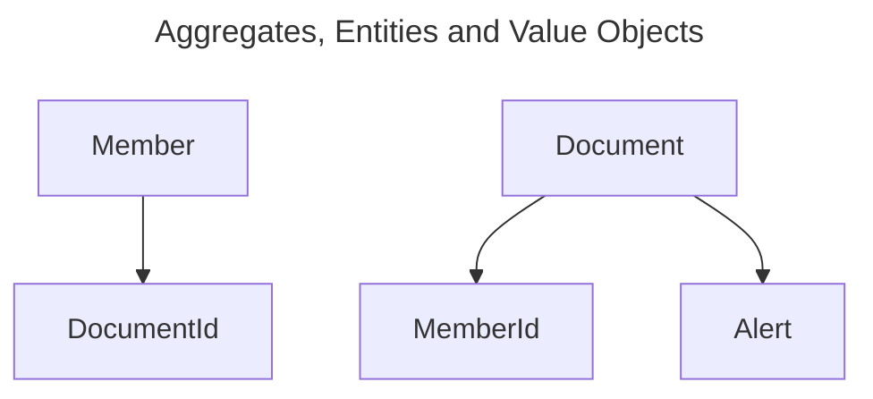

# family-manager

## How to run

```bash
cargo run
```

## Example API calls

```bash
curl --location 'http://127.0.0.1:3000/documents' \
--header 'Content-Type: application/json' \
--data '{
    "id": 1,
    "title": "Testing",
    "content": "test content"
}'

curl --location 'http://127.0.0.1:3000/documents/1'
```

## Planned Features

#### Document Manager
* Store documents and associate them with family members
* Automate reminders to alert users before documents expire

### Medical Manager
* Diary of doctor visits
* Track personal health data (height, weight, etc) over time and visualize with charts

### Location Manager
* Integrate with Google's "find my device" feature to show location of everyone on a map

### Car Manager
* Diary of mechanic visits and history

### Receipt Manager
* Upload and store receipts. Possibly parsing info such as vendor name, date, and amount from
the receipt image


