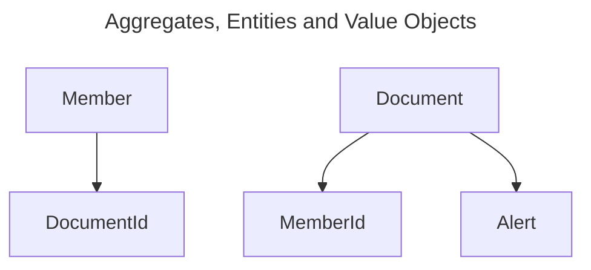

# family-manager

## Planned Features

#### Document Manager
* Store documents and associate them with family members
* Automate reminders to alert users before documents expire

### Medical Manager
* Diary of doctor visits
* Track personal health data (height, weight, etc) over time and visualize with charts

### Location Manager
* Integrate with Google's "find my device" feature to show location of everyone on a map

### Car Manager
* Diary of mechanic visits and history

