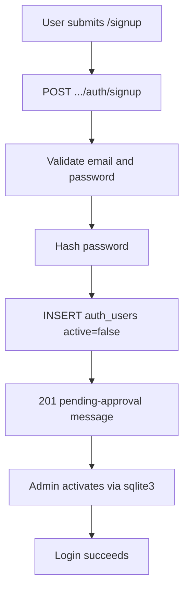

# API reference (agents)

Parent hub: [../../AGENTS.md](../../AGENTS.md). Routing diagrams: [../architecture.md](../architecture.md#http-routing).

## Endpoints

| Endpoint | Notes |
|----------|--------|
| `GET /api/health` | Returns `"up"` |
| `GET /api/version` | Build/git revision string |
| `POST /life-manager/api/v1/auth/login` | JWT login |
| `POST /life-manager/api/v1/auth/signup` | Create inactive user (email stored as `username`); returns pending-approval message; no JWT |
| `GET /life-manager/api/v1/auth/protected` | Auth smoke test |
| `POST /test-tenant/api/v1/auth/login` | JWT login (test-tenant pilot) |
| `POST /test-tenant/api/v1/auth/signup` | Create inactive user (test-tenant pilot) |
| `GET /test-tenant/api/v1/auth/protected` | Auth smoke test (test-tenant pilot) |
| `POST /life-manager/api/v1/documents/` | Multipart: `json` (CreateDocumentCommand) + `file` |
| `POST /life-manager/api/v1/documents/json` | JSON body: CreateDocumentCommand with required `storage` (Proton Drive ref); no file/OCR — see [Proton upload workflow](../development_faq.md#upload-workflow) |
| `GET /life-manager/api/v1/documents/{id}` | Single document |
| `GET /life-manager/api/v1/documents/` | Query by title |

Ops endpoints stay at `/api/*`. The v1 product API is namespaced under `/life-manager/api/v1/*`.

### Router wiring

- `backend/src/lib.rs`: stateless `/api/health`, `/api/version`; `LifeManagerTenant::mount()` and `TestTenant::mount()` nest `/life-manager` and `/test-tenant` with per-tenant state
- `backend/libs/life-manager/src/life_manager_tenant.rs`: `LifeManagerTenant` implements `TenantMount`; `api_router()` nests `/api/v1` → `auth`, `documents`
- `backend/libs/test-tenant/src/test_tenant.rs`: `TestTenant` implements `TenantMount`; `api_router()` nests `/api/v1` → `auth` only (pilot)
- `backend/libs/common/server-host/`: `AppBootstrap` (build-time only) and `TenantMount` trait

### Gateway (prod)

Nginx proxies each tenant hostname to its mount path (see `nginx/tenants.prod.json` and `nginx/generated/tenant-servers.conf.template`) plus `/api` (health/version) to the backend. See `nginx/README.md`.

## Auth

- Protected routes: `Authorization: Bearer <token>`
- Login rejects unknown credentials, inactive users (`active = false`), and principals whose `tenant` does not match the tenant mount (e.g. `life-manager`)
- Signup (`POST .../auth/signup`) accepts `{ email, password }`, stores the email in `auth_users.username`, inserts with `active = false`, and returns `201` with a pending-approval message (no JWT). Duplicate email → `400 validation_error`.



- **Manual activation:** after signup, an admin activates the account in SQLite (agents do not run write SQL):

```bash
# Dev DB path from .dev.env
sqlite3 ./data/dev-test.db \
  "UPDATE auth_users SET active = 1 WHERE username = 'user@example.com';"
```

List pending signups:

```sql
SELECT username, tenant, created_at FROM auth_users WHERE active = 0;
```

- Backend auth crate: `backend/libs/auth/` builds `AuthState` via `AuthStateBuilder`; life-manager composes it into `LifeManagerState` and wires `FromRef` via `libs/life-manager/src/infrastructure/auth_integration.rs`
- Handlers receive `AuthUser` where required
- Frontend: `useAuth()` + `authenticatedFetch` from `frontend/lib/api/client.ts` — do not hard-code origins in components

## Multipart document create

See [../development_faq.md](../development_faq.md) for Postman/examples.

## Frontend API base URL

Override order (`frontend/constants/config.ts`, `app.config.ts`):

1. `EXPO_PUBLIC_API_BASE_URL`
2. Expo `extra.apiUrl`

- **Dev:** usually `http://localhost:3000` (or host reachable from device/emulator)
- **Prod:** same origin as **gateway** — see [../../README.md](../../README.md)

### Frontend path convention

Import `apiV1` from `@/lib/api/client`. Example: `apiV1('/documents')` — do not hard-code `/api/v1` or `/life-manager` in components. The v1 prefix is set at runtime from the active tenant (`TenantProvider` → `configureApiClient`).

**Tenant resolution (frontend):** hostname or env maps to a tenant module in `frontend/lib/tenant/registry.ts`, which supplies `apiV1Prefix` (e.g. `/life-manager/api/v1`). This is separate from nginx routing but must stay aligned with backend `TenantMount::MOUNT_PATH`. Dev options: [../development_faq.md](../development_faq.md#multi-tenant-frontend-dev).

Device/emulator notes: [../development_faq.md](../development_faq.md).

### TypeScript DTOs

Request/response types for the v1 API are generated from Rust (`ts-rs`) into `frontend/lib/api/generated/`. Import via `@/lib/api/types`. Regenerate with `./backend/scripts/export_ts_bindings.sh` when backend DTOs change.
