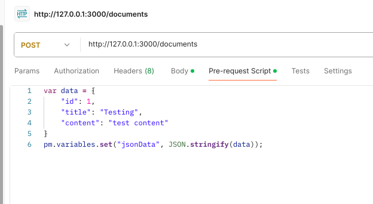
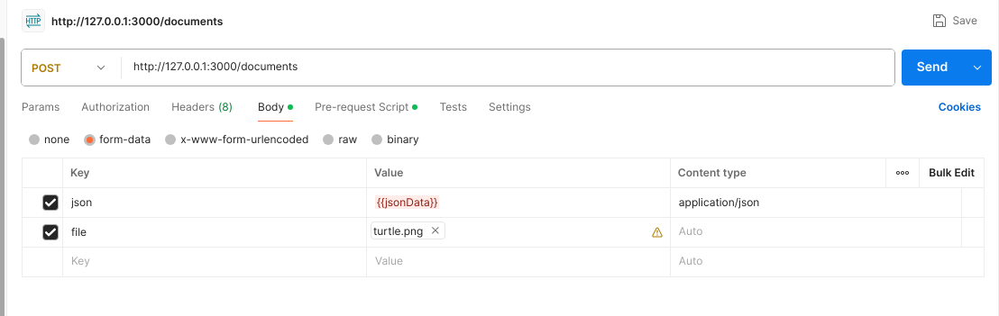
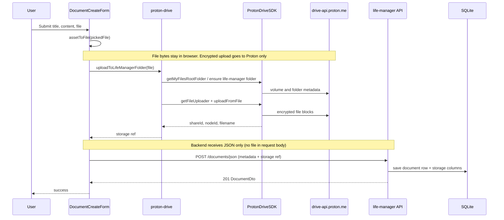
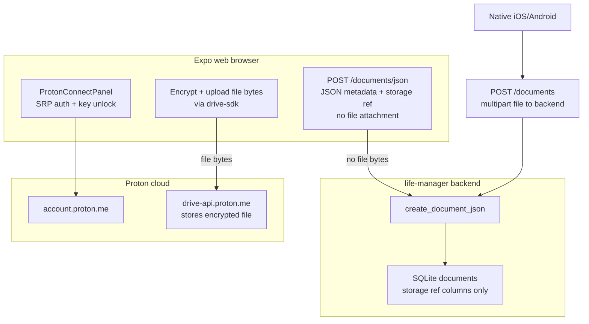

# Development FAQ

## How do I send a post request containing a file and json with postman?
[See this](https://www.baeldung.com/postman-upload-file-json)

## Example of Postman request with file and json



## Running Tests
### Integration Tests
```bash
cargo test --test '*'
```

### Unit Tests
```bash
cargo test --lib
```

### TypeScript DTO export (ts-rs)

After changing Rust API DTOs (`LoginRequest`, `DocumentDto`, `CreateDocumentCommand`, etc.):

```bash
./backend/scripts/export_ts_bindings.sh
```

Commit the updated files under `frontend/lib/api/generated/` with the Rust changes.

## Secrets and Encryption
See [git-crypt](https://github.com/AGWA/git-crypt?tab=readme-ov-file#using-git-crypt)

Recommend adding users with their own gpg key:
```bash
git-crypt add-gpg-user USER_ID
```

After cloninng the repo, unlock with:
```bash
git-crypt unlock ~/life-manager-symetric.key
```
NOTE: key is stored in my password manager

## Docker Compose profiles and ports

Root-level **`docker-compose.yml`** groups services under Compose **profiles** (**`dev`**, **`docker-dev`**, **`prod`**, **`test`**, optional **`tesseract`**). **`build_and_start_app.sh`** (and **`backend/start_backend.sh`**) pass **`--profile <profile>`** and **`--env-file .<profile>.env`** ( **`docker-dev`** uses **`.dev.env`** ) so variables like **`APP_PORT`** and **`TESSERACT_PORT`** apply consistently. The **`tesseract`** OCR sidecar is **not** included in **`dev`** / **`docker-dev`** / **`prod`** / **`test`** by default; enable it with **`--profile tesseract`** (and **`TESSERACT_ENABLED=true`**, or **`start_backend.sh --with-tesseract`**).

| Profile | Compose services | Typical host ports (see env / Compose defaults) |
|---------|------------------|--------------------------------------------------|
| **prod** | `life-manager`, `frontend`, `gateway`, `alloy` | **`NGINX_PORT`** → **`gateway`** (default **80**); **`APP_PORT`** → API container (default **3000**); **`FRONTEND_PORT`** → static **`frontend`** container (default **8080**) |
| **dev** | *(none via `build_and_start_app.sh`)* | Backend on host **`APP_PORT`** (**3000**) via **`cargo run`**; host Expo on **`FRONTEND_PORT`** (default **8080**) |
| **docker-dev** | `life_manager_dev`, `frontend_dev`, `alloy` | **`APP_PORT`** → **`life_manager_dev`** (default **3000**); **`FRONTEND_PORT`** → **`frontend_dev`** / Expo (default **8080**) |
| **test** | *(none)* | **`start_backend.sh`** skips **`docker compose`** for this profile |

**Optional OCR:** add **`--profile tesseract`** so the **`tesseract`** service runs; set **`TESSERACT_ENABLED=true`** (sample env files default **`false`**, which selects **`NoOpDocumentTextReader`** in the backend—embedded PDF text still works; remote OCR does not). Example: **`docker compose --env-file .prod.env --profile prod --profile tesseract up -d`**.

Orchestration summary: see **[`README.md`](../README.md)** (`build_and_start_app.sh`, containers vs host processes, and **prod** gateway entry). Grafana Cloud log shipping (**`alloy`**): **[`README.md` — Grafana Cloud logs](../README.md#grafana-cloud-logs-prod-and-docker-dev)**. Architecture diagrams: **[`architecture.md`](architecture.md)**.

## Local HTTP (API URL)

The backend listens on plain HTTP (see **`APP_PORT`**, default **`3000`**). For **dev**, local Expo on the host usually talks to **`http://localhost:3000`**. For **prod**, browsers should use the **`gateway`** origin (default **`http://localhost`** if **`NGINX_PORT`** is **80**) — set **`EXPO_PUBLIC_API_BASE_URL`** to that same origin when building the prod frontend, or `http://localhost:<NGINX_PORT>` if you changed **`NGINX_PORT`**. Override with **`EXPO_PUBLIC_API_BASE_URL`** or Expo **`extra.apiUrl`** whenever the API is on another host or port.

- **Android Emulator:** run `adb reverse tcp:3000 tcp:3000` so the emulator’s `localhost:3000` reaches your machine. Use `http://localhost:3000` for the API URL when reversed.
- **Physical devices** on the LAN should set `extra.apiUrl` / env to an origin the device can reach (for example `http://192.168.1.10:3000`).

**Quick check**

```bash
# Ops endpoints (unchanged path)
curl -v --max-time 8 http://localhost:3000/api/health

# v1 API (dev: direct to backend; prod: use gateway origin + same path)
curl -v --max-time 8 'http://localhost:3000/life-manager/api/v1/documents'
```

### Frontend base URL

See `frontend/constants/config.ts` for resolution order (`EXPO_PUBLIC_API_BASE_URL` → `extra.apiUrl` → default).

### Multi-tenant frontend (dev)

The web bundle resolves the active tenant at runtime. Production uses the page hostname (subdomain or custom domain) mapped in `frontend/lib/tenant/registry.ts`. Native builds use `EXPO_PUBLIC_TENANT`.

**Localhost options (use any or combine):**

1. **Default tenant (simplest):** no extra setup — plain `http://localhost:8080` resolves to `life-manager`.
2. **Env override:** `EXPO_PUBLIC_DEFAULT_TENANT=life-manager` (web localhost / `127.0.0.1`) or `EXPO_PUBLIC_TENANT=life-manager` (native).
3. **Query param (web):** `http://localhost:8080?tenant=life-manager` or `?tenant=test-tenant`
4. **Fake subdomain:** add to `/etc/hosts` then browse the subdomain:
   ```text
   127.0.0.1 life-manager.localhost
   127.0.0.1 test-tenant.localhost
   ```
   `life-manager.localhost` and `test-tenant.localhost` are registered in `frontend/lib/tenant/registry.ts`.

Prod TLS uses **separate Let's Encrypt certs per tenant hostname** (see `nginx/tenants.prod.json`). After adding a tenant:

1. Add DNS A record: `<tenant-id>.jeszenka.com` → server IP  
2. Use the **add-tenant** Cursor skill (`.cursor/skills/add-tenant/`)  
3. Deploy — `scripts/provision-tenant-tls.sh` runs on the server before gateway restart  

Regenerate committed nginx locally: `./scripts/generate-nginx-tenant-servers.sh`

Example with host Expo + direct backend:

```bash
cd frontend
EXPO_PUBLIC_DEFAULT_TENANT=life-manager EXPO_PUBLIC_API_BASE_URL=http://localhost:3000 npm run web
# test-tenant pilot:
EXPO_PUBLIC_DEFAULT_TENANT=test-tenant EXPO_PUBLIC_API_BASE_URL=http://localhost:3000 npm run web
# or: http://localhost:8080?tenant=test-tenant
```

JWT storage is scoped per tenant (`auth_token:<tenant-id>`) so switching tenants in dev does not reuse the wrong session.

**Tenant theme overrides:** add or edit the optional `theme` block in `tenants/<id>/meta.ts` (e.g. `light: { tint: '#336699' }`). Reload the web app or restart Expo to pick up meta changes. Combine with `?tenant=<id>` when testing multiple tenants on localhost.

See `frontend/AGENTS.md` for layout conventions (`tenants/<id>/` vs shared code) and theme hooks.

## Proton Drive (experimental, web only)

life-manager can upload document files **directly to Proton Drive** from the **Expo web** build (desktop or mobile browser). The native Expo app still uses the backend multipart upload path without Proton.

- **Connect:** Home screen → **Proton Drive (experimental)** panel. You log in to Proton in the browser; credentials stay client-side only (never sent to the life-manager backend).
- **Upload flow:** Connect Proton → create a document with title/content → attach a file → submit. The file is encrypted and uploaded via `@protontech/drive-sdk`; metadata (Proton node IDs) is saved via `POST /life-manager/api/v1/documents/json`.
- **OCR:** Skipped for Proton-backed uploads in v1 — enter title and content manually.
- **Dependencies:** `@protontech/drive-sdk`, `@protontech/crypto` (see `frontend/lib/proton-drive/`).
- **Status:** Proton’s SDK is preview-only; a breaking crypto migration is expected late 2026 / early 2027. Personal/non-commercial use only per Proton’s SDK terms.
- **Migration:** After pulling backend changes, run `diesel migration run` for the new document storage columns.

### Upload workflow

The file **never reaches the life-manager backend**; only Proton node IDs and document metadata are saved in SQLite. Encrypted file bytes go straight to Proton Drive from the browser.

#### Sequence (web, Proton connected)



#### Trust boundaries (web vs native)



### TLS in production

HTTPS is not terminated inside the Rust server. Put Nginx, Caddy, or another reverse proxy in front if you need TLS; point the frontend’s API URL at the HTTPS origin clients use.


